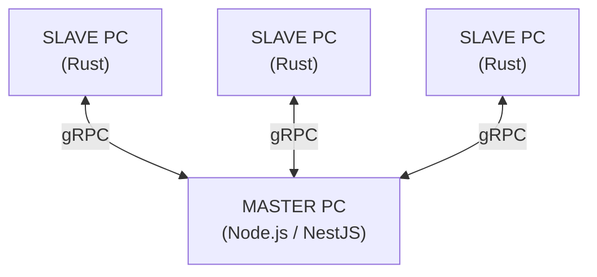

# CHECK NODE

client watch program, master pc가 slave pc들에 대하여 특정 URL, 프로그램에 접근하는 것을 차단시키는 프로그램이다.

master pc와 slave pc는 전부 window여야 한다.

---

## 수행하는 역할
1. 웹사이트 접근 제어
2. 프로그램 실행 제어

---

## TOOLS
- master: Node.js / NestJS
- slave: Rust
- master to slave and slave to master protocol: gRPC
- shared protocol contract: `pb/service.proto`

---

## Directory Structure
- `/pb`: master와 slave가 공유하는 protobuf/gRPC 계약
- `/master_pc`: Node.js based master pc code (NestJS)
- `/slave_pc`: Rust based slave pc code

---

## 실행 방법

### Master PC

```bash
cd master_pc
npm install
npm run start:dev
```

- HTTP 관리자 API: `http://localhost:3000`
- gRPC slave 통신 포트: `0.0.0.0:50051`

운영 또는 공유 네트워크 환경에서는 관리자 API key를 반드시 설정한다.

```bash
ADMIN_API_KEY=change-me GRPC_SHARED_TOKEN=slave-token npm run start:prod
```

`GRPC_SHARED_TOKEN`을 설정하면 slave도 같은 환경변수를 사용해야 master gRPC에 연결할 수 있다.

대시보드를 별도 origin에서 실행할 경우 허용 origin도 명시한다.

```bash
ADMIN_CORS_ORIGINS=http://localhost:5173,http://127.0.0.1:5173
```

### Slave PC

```bash
cd slave_pc
cargo run
```

현재 slave는 Windows API로 프로세스를 감시하므로 실제 기능 검증은 Windows에서 진행해야 한다.

---

## 테스트 방법

### Master PC

```bash
cd master_pc
npm run build
npm test
npm run test:e2e
```

### Slave PC

```bash
cd slave_pc
cargo test
```

---

## 현재 구현 흐름

1. master가 HTTP 서버와 gRPC 서버를 함께 실행한다.
2. slave가 master의 gRPC 서버에 연결하고 `Register` RPC로 slave id를 발급받는다.
3. slave가 `SubscribePolicy` RPC stream을 구독한다.
4. 관리자가 `POST /admin/policy`로 차단 정책을 갱신하면 master가 연결된 slave들에게 정책을 push한다.
5. slave는 Windows 환경에서 WMI 이벤트 수신을 대기하여 실시간으로 프로세스 생성/종료를 감지하고 차단합니다. (에이전트 시작 시 베이스라인 스냅샷으로 기존 차단 대상을 1회 검사 및 종료)
6. 실행 중인 프로세스가 `blocked_processes`와 일치하면 종료하고 `ReportEvent` RPC로 master에 보고한다.

관리자 API key가 설정된 경우 HTTP 요청에는 `X-Admin-API-Key` 헤더가 필요하다.
gRPC shared token이 설정된 경우 slave는 `x-checknode-token` metadata를 자동으로 첨부한다.

---

## 프로그램 다이어그램



---

## TASK
- [ ] url 제어 (도메인 차단 방식 설계/구현)
- [x] 프로세스 제어 (WMI 이벤트 기반 실시간 차단)
- [ ] 실행 전 제어 입력 처리
- [ ] 실행도중 제어 입력 처리
- [ ] master pc 관리자 대시보드
- [ ] slave gRPC 연결 유실 시 자동 재연결 메커니즘 구축 (마스터 재기동 대응)
