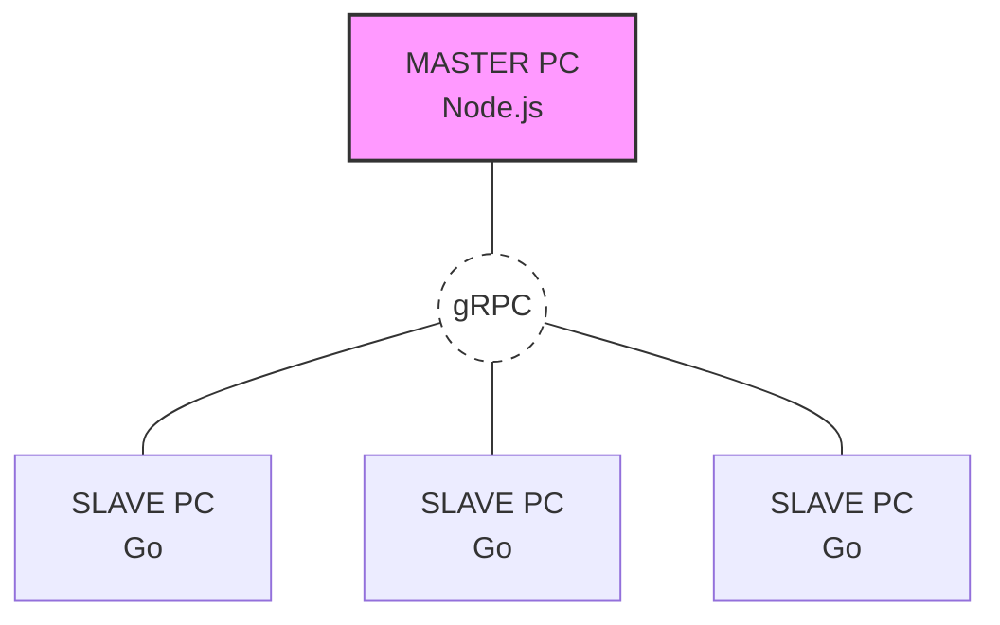

# CHECK NODE

client watch program, master pc가 slave pc들에 대하여 특정 URL, 프로그램에 접근하는 것을 차단시키는 프로그램이다.

master pc와 slave pc는 전부 window여야 한다.

---

## 수행하는 역할
1. 웹사이트 접근 제어
2. 프로그램 실행 제어

---

## TOOLS
language: go1.26.1(slave), Node.js(master)
virtual environment: Docker
master to slave and slave to master protocol: gRPC

---

## Directory Structure
- '/pb' : gRPC
- '/master_pc' : Node.js based master pc code (NestJS)
- '/slave_pc' : Go based slave pc code

---

## 프로그램 다이어그램

---

## TASK
- url 제어
- 프로세스 제어
- 실행 전 제어 입력 처리
- 실행도중 제어 입력 처리
- master pc 관리자 대시보드
- DB 구축
- WMI 이용하는 방향으로 변경하여 polling -> event 방식으로 변경
